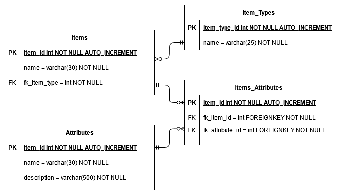
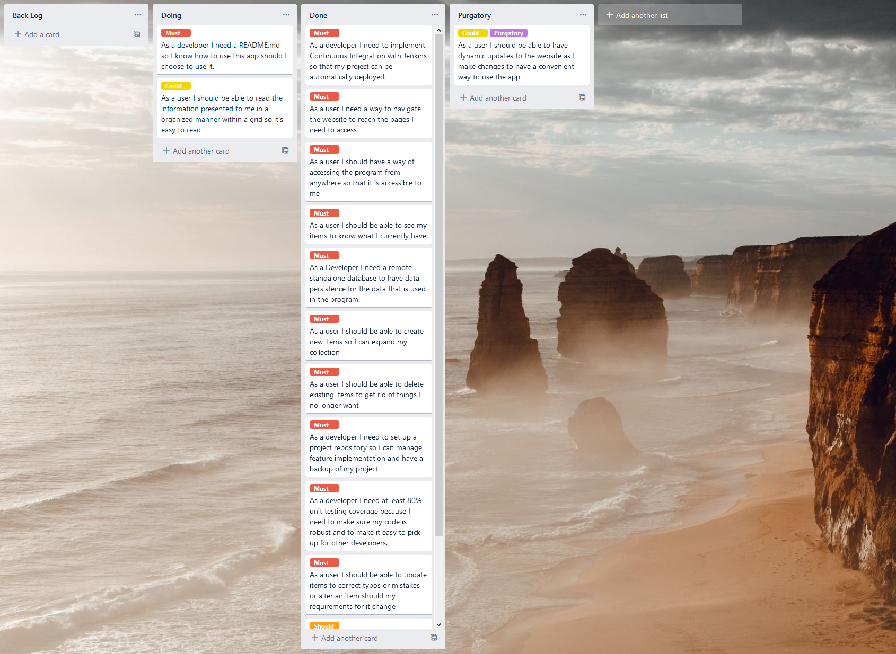
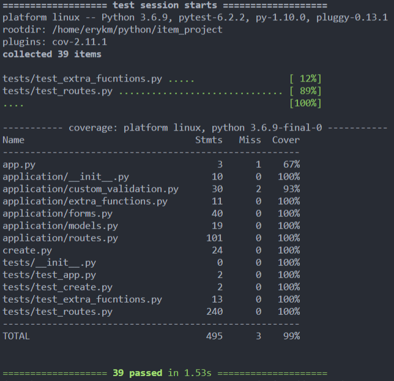

# &nbsp; &nbsp;  Item Creator V1.0.1

## About

Item creator is a program that lets users create items, types of items and attributes and combine them to create unique items with shared attributes.

## Tools Used

* Trello
* Visual Studio Code
* Python
* Jenkins
* Gunicorn
* Flask
* Ubuntu 18.04
* GCP

## Setting Up

To run this app succesfully you will need to navigate to application/init.py and change some configuration options.

* SQLALCHEMY_DATABASE_URI needs to reflect your database if it is local use the following format "SQL_language:///name_of_your_db". For a standalone database you will need to use the following format "SQL_language+pymysql://username:password@ip_address/database_name"
* SECRET_KEY can be any key you want to use, it is used to secure traffic from the Flask web forms.
* DEBUG set to False if it is not debugging.

You will also need to install all the requirements for the project so far which are listed out in the requirements.txt file to install use the following.

* pip3 install -r requirements.txt

Lastly you also need to run the create.py script to create the database models and populate it with some dummy sample data.

* navigate to the project folder in your terminal
* python3 create.py

### *Useful additions*

If you cannot connect to your stand alone databse make sure that the machine that is accesing it is whitelisted. This may vary pased on various cloud providers.

## Design

### Project DB ERD

This diagram is very simpified as items could be broken down into different types of items which would have their own data for example weapons might have damage while tools might have use cases. Idealy this would expand into a character table to allow a character to hold all the various items.

### Kanban Board

I used a kanban board to help me list out and track the progress of tasks that are done or need doing, I used a MoSCoW system to identify the priority of tasks renaming "wont" into "purgatory" for a bit of flavor to scrapped ideas that were not necassary to the project part way through development.

I managed to complete all the major tasks as of writing this, only really lagging behind on one nice to halve feature which was the grids. Part way through the development I realised that making the page dynamicaly update was a bit out of the scope of what I was aiming for in this project so it got scrapped.

## Test Coverage

The tests cover 99% of the application including the test scripts, at the time of writing the only real code that is missed are the custom validation exceptions as I don't have a way to pass in certian data into the forms to test a fail case in the try statement. The testing is encompasing a successful and a failed state for the routes and their logic although a bit repetative it does encompas most cases that could occur. The tests also do not go over the app if statement as that only works if its the main script that is being run.

## Risks

* Due to the open nature of the app, it makes it easy for anyone to access and edit data, it also contains cascading deletes which do make the data in the database really succeptable to damage.
* Another problem is if any of the rows end up with NULL data it will not display it at all. Breaking the read functionality of the app.

### Risks during development

During development I had taken a few risks to try and deliver a different project one of which was to try and condense the entire project into a single route and have a control form that would tell the rest of the web page how to behave. This was cut as part way through development it started turning into a much more unmanagable project causing more problems that it might have solved.

At another point I also tried implementing grids but couldnt find a way to have the columns change dynamicaly based on the data provided, though it wouldn't be difficult to implement at this stage I chose to forgo it and implement the core functionality instead.

## Improvements

The app has aspects that I am not happy with that could have been improoved in the final product, when adding or deleting being able to see the database while adding to it would make it easier on the user as they would know if they are adding in unnecasary data.

The front end flask application has no css or any stylising so an addition to make the website more apealing and structured would be a good adition for user experience.

A fair amount of the code in routes.py is also very similar I belive it could be condensed into individual functions however due to my inexperinece with Flask I was unsure how to loop through the database with it, a much more elegant solution is definataly possible.

## Attributions

Dara Oladapo, core instructor for the project

Vinesh Ghela, for introducing me to GCP and basic Linux

QA community

Steven for the syntax for a cascade delete in Flask
<https://stackoverflow.com/questions/5033547/sqlalchemy-cascade-delete>

Though not used in the final build W3 schools did show me some CSS with grids during the project <https://www.w3schools.com/css/css_grid.asp>
